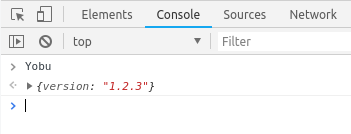

.. _dom_matcher:

DOM Matcher
===========

======  ===
Format  ``(check_statement=string:required, extractor=string:optional)``
Type    tuple
Scope   DOM
======  ===

It operates on the DOM_ loaded by the browser.
When there are some data representation issues (minification, bundles, etc)
it's better to access the objects already loaded in browser's DOM_
than trying to parse them with regular expressions.

This matcher is useful to extract information
from objects loaded in the DOM
that could contain version information under some attribute.

Example
^^^^^^^

A website ``X`` uses a software called ``yobu``.
It's loaded as part of a bundle file called ``assets.js``
that groups every *Javascript* file used by the website.
Moreover, this file is obfuscated and
its content changes every time there's a change
because of a internal building process.

No way to use a regular expression here.
However, in the browser's *Javascript* console
you can see that there's a ``Yobu`` object.

We will use a DOM matcher to extract that data.
The first element of the tuple is a ``check_statement`` written in Javascript.
What should be able to give us this statement?
It will assert that the target object exists in the DOM
to continue with version extraction.

The second element is an ``extractor`` statement written in Javascript
and it will try to access the attribute where version data lies.
Finally, we are ready with our new matcher:

.. code-block:: python

    from detectem.plugin import Plugin

    class YobuPlugin(Plugin):
        name = 'yobu'
        matchers = [
            {'dom': ('window.Yobu', 'version': 'window.Yobu.version')},
        ]

Then, when you run detectem on ``X``,
it will detect the presence of ``yobu`` and its version ``1.2.3``.

Notes
^^^^^

The plugins use ``window`` as prefix because
the check statement won't raise any error if the object doesn't exist,
it's easier to emulate browser in our testing suite and avoid side effects
in presence of iframes.

.. _DOM: https://en.wikipedia.org/wiki/Document_Object_Model
.. _D3.js: https://d3js.org/
